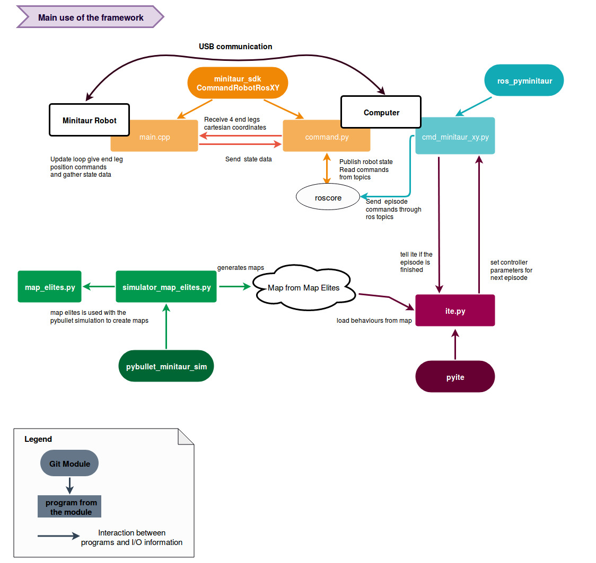
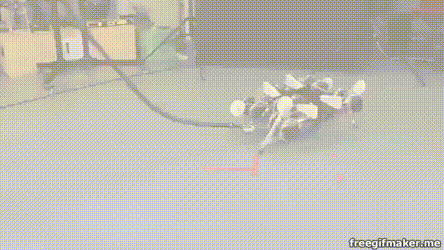

# Minitaur Framework

This framework contains everything needed to use [IT&E](https://github.com/resibots/ite_v2) and [Map-Elites](https://github.com/resibots/map_elites_hexapod) with the [minitaur](http://ghostrobotics.gitlab.io/SDK/Introduction.html) from ghost robotics. It includes the followings :

* [minitaur_sdk](https://github.com/resibots/minitaur_sdk.git) - The minitaur ghost robotics sdk with some custom examples to be able to read and send commands from ROS and though USB

* [ros_pyminitaur](https://github.com/resibots/ros_pyminitaur.git) - The ros package with everything needed to read maps created with Map Elites and send the commands to the minitaur through ros

* [pybullet_minitaur_sim](https://github.com/resibots/pybullet_minitaur_sim.git) - This contains a pybullet minitaur simulation based on [this](https://github.com/bulletphysics/bullet3/tree/master/examples/pybullet/gym/pybullet_envs/minitaur/envs) github repository . The pybullet_minitaur_sim defines everything needed to run episodes and create maps with Map Elites.

* [pyite](https://github.com/resibots/pyite.git) - An IT&E implementation in python, it can be used with pybullet for simulation or with ros to send commands to the real robots. It is selecting the best behaviors in the maps created with Map Elites thanks to a bayesian optimization process


You can see below a graphical overview of the framework :




You can click on the GIF to watch the full IT&E minitaur video:

[](https://www.youtube.com/watch?v=v90CWJ_HsnM)


## Installation
<!---
### With docker

Download the docker image from mybox :

TO DO CREATE DOCKER SERVER OR DOCKER HUB PAGE

Then run :

``` docker load --input minitaur.tar ```


On your computer run ```xhost +local:docker``` to be able to display graphical interfaces.

If you want to work with the real minitaur robot, you will need allow docker to access to the right USB dev port.


For this, plug to the minitaur and check the USB dev port.

If it is ```/dev/ttyUSB0 ``` run the docker container with the following command
```
docker run -it --net=host --rm    --user=root     --env="DISPLAY"  --device=/dev/ttyUSB0   --workdir="/home/$USER"   --volume="/etc/group:/etc/group:ro"     --volume="/etc/passwd:/etc/passwd:ro"     --volume="/etc/shadow:/etc/shadow:ro"     --volume="/etc/sudoers.d:/etc/sudoers.d:ro"     --volume="/tmp/.X11-unix:/tmp/.X11-unix:rw"     minitaur
```

If you only want to run simulations you can directly run :

```
docker run -it --rm --net=host     --user=root     --env="DISPLAY"   --workdir="/home/$USER"   --volume="/etc/group:/etc/group:ro"     --volume="/etc/passwd:/etc/passwd:ro"     --volume="/etc/shadow:/etc/shadow:ro"     --volume="/etc/sudoers.d:/etc/sudoers.d:ro"     --volume="/tmp/.X11-unix:/tmp/.X11-unix:rw"     minitaur
```

By default you will connect to the minitaur in an anaconda python 3.6.7 environment. You need to use this environment when working with simulation and pybullet. You can type ```py36``` to swith to the python 3.6.7 environment.

If you work with the real minitaur, you will need to use python 2.7 (official python version for ros). You can type ```rospy27``` to swith to the python 2.7 environment.

The instructions to run experiments are written below. Those are working both for an installation with and without docker. Nevertheless you will probably need to connect several time to your docker container.

Once you have run a ```docker run -it ``` command, a docker container has been created. On a terminal of your computer, if you run ```docker container ls``` you can see the running containers. If you recover the CONTAINER_ID and run : ```docker exec CONTAINER_ID /bin/bash ```, you will connect to the existing container and you can run new commands.

If you want to save your the work that you have done inside the container, you can run ```docker commit CONTAINER_ID name_of_your_image:custom_label ```. It will save the modifications in an image name_of_your_image with the label custom_label.

### Without docker
-->

Clone this repository and run :
```
git submodule update --init --recursive
```

You will then need two python environments. One for the simulation with python 3.6.7 and another with python 2.7 (official python version for ros-kinetic)

Here are some of the dependencies:

python 3.6.7:
  * gym
  * tensorflow
  * matplotlib
  * sklearn
  * pybullet
  * gpy

python 2.7 / ros-kinetic:

  * install vrpn with : ``` apt-get install ros-kinetic-vrpn*```


## How to launch a minitaur experiment when you have map_elites maps?
#### First launch a roscore on your computer

```
roscore
```

#### Then use the minitaur_sdk

Go to the minitaur_sdk repository

Plug the minitaur with a usb cable

Upload the CommandRobotRosXY (or the CommandRobotRosXYDamaged to test with a damage).


```
cd minitaur_sdk/example/CommandRobotRosXY/
make
```

Wait until the upload is complete.
Check the usb port adress and if needed change it in command.py ( default is "/dev/ttyUSB0" ). Then execute :

```
sudo -s
python command.py
```

You should now be able to retrieve data from ros topics and send cartesian commands to the legs. For more details refer to the README.md of [minitaur_sdk](https://github.com/resibots/minitaur_sdk.git)

Note that a safety limit has been implemented. If one motor is trying to use more than 25A for more than 1second, the motors will be disabled. The following framework will automatically enable the motors at each new episode.


#### Then use the ros_pyminitaur package

Copy or clone the ros_pyminitaur repository in your catkin_workspace.
If needed make the python scripts in the script folder executable with ```chmod +x my_script.py ```

Execute the followings:
```
roslaunch vrpn_optitrack_minitaur.launch
rosrun pyminitaur cmd_minitaur_xy.py
```

VRPN needs to be able to recover the minitaur position through the minitaur frame.
The cmd_minitaur_xy node will wait for commands to run episodes on the real robot.

cmd_minitaur_xy.py will allow you to run episodes with a specific duration. For more details please refer to the README.md of [ros_pyminitaur](https://github.com/resibots/ros_pyminitaur.git)

Note that you can use test_maps.py to test some behaviors but you can also use pyite as depicted in the following section

#### Then use pyite

Go to the pyite folder and execute :

```
python ite.py maps/minitaur/centroids_40000_16.dat maps/minitaur/archive_20000.dat 1 minitaur
```

 For more details please refer to the README.md of [pyite](https://github.com/resibots/pyite.git)


#### Instead of pyite you can also test maps


test_maps.py is located in the ros_pyminitaur/script folder.

This node allows you to randomly test x behaviours from n maps and save the results (real travelled distance)
You need to specify a path containing map_elites maps as an argument.

The following specific file tree organisation needs to be respected for n maps :

- path_to_folder_containing_maps/
  - 1/
    - centroid_file
    - archive_file
  - 2/
    - centroid_file
    - archive_file
  - ../

  - n/
    - centroid_file
    - archive_file

You will have tune the name of the archive_file and centroid_file directly in test_maps.py (line 92 and line 94)

Then you can execute :

```
python test_maps.py path_to_folder_containing_maps
```

If you want to test 10 maps you can use ite_final_test_maps.py

For more details please refer to [ros_pyminitaur](https://github.com/resibots/ros_pyminitaur.git)

## How create map_elites maps for the minitaur ?

Go to the pybullet_minitaur_sim folder and refer to the README.md file [pybullet_minitaur_sim](https://github.com/resibots/pybullet_minitaur_sim.git)
